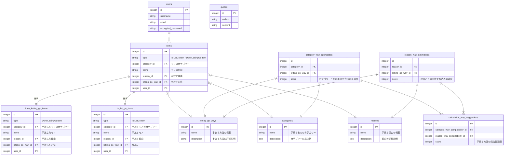

```mermaid
erDiagram

users ||--o{ items : ""
items }|--|| categories : ""
items }|--|| reasons : ""
items }|--|| letting_go_ways : ""
category_way_optimalities ||--|{ calculation_way_suggestions : ""
reason_way_optimalities ||--|{ calculation_way_suggestions : ""
category_way_optimalities }|--|| categories : ""
category_way_optimalities }|--|| letting_go_ways : ""
reason_way_optimalities }|--|| reasons : ""
reason_way_optimalities }|--|| letting_go_ways : ""
items ||--|| to_let_go_items : "継承"
items ||--|| done_letting_go_items : "継承"

users {
integer id PK
string username
string email
string encrypted_password
}

items {
integer id PK
string type "ToLetGoItem / DoneLettingGoItem"
integer category_id FK "モノのカテゴリー"
string name "モノの名前"
integer reason_id FK "手放す理由" 
integer letting_go_way_id FK "手放す方法"
integer user_id FK  
}

to_let_go_items {
integer id PK
string type "ToLetGoItem"
integer category_id FK "手放すモノのカテゴリー"
string name  "手放すモノ"
integer reason_id FK "手放す理由"
integer letting_go_way_id FK "NULL"
integer user_id FK  
}

done_letting_go_items {
integer id PK
string type "DoneLettingGoItem"
integer category_id FK "手放したモノのカテゴリー"
string name "手放したモノ"
integer reason_id FK "手放した理由" 
integer letting_go_way_id FK "手放した方法"
integer user_id FK  
}

categories {
integer id PK 
string name "手放すもののカテゴリー"
text description "カテゴリーの具体例"
}

reasons {
integer id PK 
string name "手放す理由の概要"
text description "理由の詳細説明"
}

letting_go_ways {
integer id PK 
string name "手放す方法の概要"
string description "手放す方法の詳細説明"
}

category_way_optimalities {
integer id
integer category_id FK
integer letting_go_way_id FK
integer score "カテゴリーごとの手放す方法の最適度"
}

reason_way_optimalities {
integer id
integer reason_id FK
integer letting_go_way_id FK
integer score "理由ごとの手放す方法の最適度"
}

calculation_way_suggestions {
integer id PK
integer category_way_compatibility_id FK 
integer reason_way_compatibility_id FK 
integer score "手放す方法の総合最適度"
}

quotes {
integer id PK 
string author
string content
}
```
