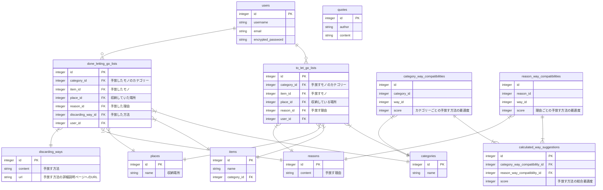

```mermaid
erDiagram

users ||--o{ to_let_go_lists : ""
users ||--o{ done_letting_go_lists : ""
to_let_go_lists }|--|| categories : ""
done_letting_go_lists }|--|| categories : ""
to_let_go_lists }|--|| items : ""
done_letting_go_lists }|--|| items : ""
to_let_go_lists }|--|| places : ""
done_letting_go_lists }|--|| places : ""
to_let_go_lists }|--|| reasons : ""
done_letting_go_lists }|--|| reasons : ""
done_letting_go_lists }|--|| discarding_ways : ""
category_way_compatibilities ||--|{ calculated_way_suggestions : ""
reason_way_compatibilities ||--|{ calculated_way_suggestions : ""
category_way_compatibilities }|--|| categories : ""
reason_way_compatibilities }|--|| reasons : ""

users {
integer id PK
string username
string email
string encrypted_password
}

to_let_go_lists {
integer id PK
integer category_id FK "手放すモノのカテゴリー"
integer item_id FK "手放すモノ"
integer place_id FK "収納している場所"
integer reason_id FK "手放す理由"
integer user_id FK  
}

done_letting_go_lists {
integer id PK
integer category_id FK "手放したモノのカテゴリー"
integer item_id FK "手放したモノ"
integer place_id FK "収納していた場所"
integer reason_id FK "手放した理由" 
integer discarding_way_id FK "手放した方法"
integer user_id FK  
}

categories {
integer id PK 
string name
}

items {
integer id PK 
string name 
integer category_id FK 
}

places {
integer id PK 
string name "収納場所"
}

reasons {
integer id PK 
string content "手放す理由"
}

discarding_ways {
integer id PK 
string content "手放す方法"
string url "手放す方法の詳細説明ページへのURL"
}

category_way_compatibilities {
integer id
integer category_id 
integer way_id
integer score "カテゴリーごとの手放す方法の最適度"
}

reason_way_compatibilities {
integer id
integer reason_id 
integer way_id
integer score "理由ごとの手放す方法の最適度"
}

calculated_way_suggestions {
integer id PK
integer category_way_compatibility_id FK 
integer reason_way_compatibility_id FK 
integer score "手放す方法の総合最適度"
}

quotes {
integer id PK 
string author
string content
}
```
